# TDCS 國道車流資料下載清洗 CLI ‧ 期末書面報告

> **第 17 組** ‧ 專題名稱：《17_關於我在無意間被隔壁車道的卡車學長撞成廢人這件事》
> 交流道：國道 1 號麻豆段（01F2930N / 01F2930S / 01F3019N / 01F3019S）
> 繳交日期：2026 年 6 月 10 日
> Repo（教學版）：https://github.com/eason07-7/112021024TDCS

### 小組成員與分工

| 姓名（學號）| 分工內容 | 貢獻度 |
|---|---|---|
| 辛弈序（112021004）| CLI 前端：ink 互動式 wizard 五步介面、輸出落點選單（本機 / S3 / 兩邊）、`status` 子指令與清洗進度輪詢顯示 | 0% |
| 謝秉宏（112021024）| AWS 雲端後端與 IaC：Lambda 清洗函式部署、SQS broker（含 DLQ）、API Gateway 路由、S3 / Glue / Athena 配置、Terraform 一鍵自架腳本 | 0% |
| 陳睿綸（113021091）| 下載鏈與清洗驗證：E6 client-side 台灣 IP 下載上傳、`tdcs-clean` 清洗模組與 schema 型別修正、Athena 查詢與資料正確性比對 | 0% |
| 謝晴如（114021168）| 文書製作：書面報告與簡報 | 0% |

---

## 目錄

1. 系統定位
2. 系統架構
   - 2.1 AWS 資源配置一覽（terraform spec ↔ AWS live 雙錨對齊）
   - 2.2 CLI wizard 實際操作畫面（TUI 五步）
   - 2.3 AWS console 配置實證
   - 2.4 資料覆蓋範圍 — 8 週 / 3 個月、跨學期累積
3. 概念設計八大重點（Concept Design Highlights）
   - 3.1 重複下載判斷 — 不浪費 S3 上傳
   - 3.2 SQS broker pattern — 30 秒 vs 14 分鐘的鴻溝
   - 3.3 git SHA tag 版控 — 不再用 :latest 鎖死
   - 3.4 Schema 型別漂移 — 抓 bug → root cause → 修好
   - 3.5 Lambda > Glue ETL trade-off — 對的工具解對的問題
   - 3.6 E6 client-side relay winner — 三跳板實驗的科學選擇
   - 3.7 Wizard 三選項輸出 — user 自選資料落點
   - 3.8 資料正確性的誠實驗證 — 14,116 vs 14,058
4. 已驗證核心邏輯
   - 4.1 端到端跑通數據
   - 4.2 Structural 三證 baseline
   - 4.3 用清洗成果做基本視覺化與分析（手動、3 個月、跨匝道 + 跨月）
5. 與期中手工流程對比
6. v3.0 設計：自帶帳號、一次苦工、全民共享（含 cloud-portable + local-only 雙 fork）
7. 分析費用（AWS Bill / Cost Explorer）
8. 結語
   - 8.1 學習心得（各組員、依規則 R17）
   - 8.2 工程方法論收穫
9. 小組會議紀錄

---

## §1 系統定位

本專題把期中針對**國道 1 號麻豆段**所做的「下載 → 清洗 → 視覺化 → 分析」一次性手工流程，升級成一套**參數化、可重現、未來通用的命令列工具（CLI）+ AWS 雲端後端**。

**核心價值**：讓**未來任何有 TDCS 國道車流資料需求的人**——研究者、學生、工程師——**省下「自己寫程式下載原始資料 + 自己寫程式清洗髒資料」的大量時間**。過去每個人都得各自摸索 TDCS 的下載與清洗；現在只要一行指令、跟著 wizard 五步，就能拿到乾淨、可直接分析的結果。

**AWS 在其中的角色**：把「大資料的儲存與清洗運算」這些笨重的工作交給雲端——**S3** 存放原始與清洗結果、**Lambda** 執行清洗、**SQS** 串接非同步任務、**Glue + Athena** 讓清洗後資料直接用 SQL 查詢。使用者的電腦只負責「發任務、拿輕量結果」，不必承擔大資料的儲存與運算壓力。

> **一句話**：同一套工具，麻豆段能跑，未來任意國道路段也能跑。

### 研究目標路段：國道 1 號麻豆段（4 匝道）

| GantryID | 方向 | 區段 |
|---|---|---|
| 01F2930N | 北上 | 下營系統 → 新營 |
| 01F2930S | 南下 | 新營 → 下營系統 |
| 01F3019N | 北上 | 麻豆 → 下營系統 |
| 01F3019S | 南下 | 下營系統 → 麻豆 |

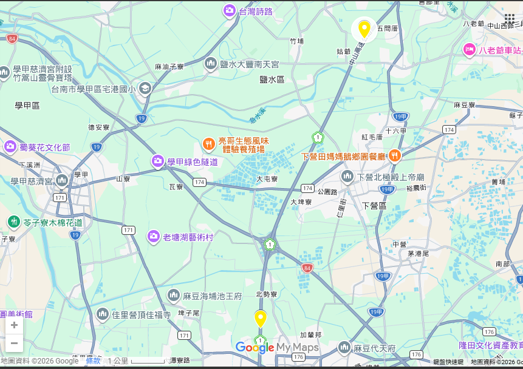

> 🗺 互動式地圖：<https://www.google.com/maps/d/u/0/viewer?mid=1BNHpenBn9yceKq8ngwA19DgrezYHPqI&ll=23.23506832590791%2C120.24123932287914&z=13>

---

## §2 系統架構

五件套：CLI（本機）+ Lambda（清洗）+ S3（儲存）+ Glue Data Catalog（schema）+ Athena（查詢）。

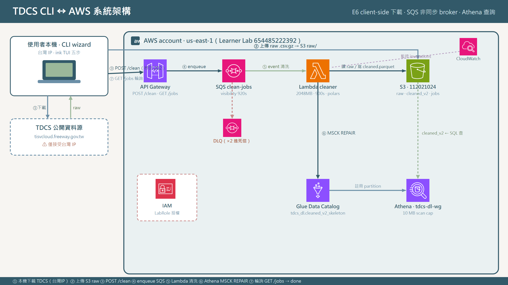

> 圖：完整端到端架構——本機（台灣 IP）下載 TDCS → 上傳 S3 raw/ → API Gateway → SQS 非同步 broker → Lambda 清洗（polars）→ Parquet 寫回 S3 cleaned_v2/ → Glue 註冊 + Athena 查詢；DLQ 補失敗、CloudWatch 監控、IAM LabRole 授權。

關鍵設計：

- **CLI ↔ AWS API 分離**：CLI 完全可離線運作（pull 走 E6 client-side 直接相對 TDCS）、AWS 只在 clean / Athena query 時必要
- **同步 producer + 非同步 consumer**：API GW 30 秒整合 timeout vs Lambda 最長 15 分鐘清洗時間、靠 SQS broker 切兩段，見 §3.2
- **Pascal→snake schema mapping**：TDCS 原 CSV header 是 PascalCase（`GantryID_O`），Glue + Parquet 統一 snake_case（`gantry_id_o`）、避免大小寫衝突

### §2.1 AWS 資源配置一覽（terraform spec ↔ AWS live 雙錨對齊）

下表每一列的「配置值」皆有兩個來源互相佐證：左為 Terraform 程式碼（configuration as code、可複現），右為 2026-06-04 從部署環境 `aws ... get-*` 實際撈回的 live 值——兩者完全一致，證明「寫的配置」與「跑的配置」零漂移。

| 資源 | 關鍵配置（live = terraform） | IaC 出處 | 配圖 |
|---|---|---|---|
| **Lambda** `tdcs-dl-cleaner` | memory **2048 MB**、timeout **900 s**、ephemeral **1024 MB**、package=Image(ECR)、trigger=API GW + SQS | `lambda.tf` + `sqs.tf` | demo_17 |
| **SQS** `tdcs-dl-clean-jobs` | visibility **920 s**（>Lambda 900 s）、DLQ redrive **maxReceiveCount=2**、retention 1 天 | `sqs.tf` | demo_18 |
| **SQS DLQ** `…-dlq` | retention **14 天**（失敗訊息保留供查） | `sqs.tf` | demo_18 |
| **Event source mapping** | SQS → Lambda、**batch_size=1**（單清洗任務/invoke） | `sqs.tf` | demo_17（trigger）|
| **Athena workgroup** `tdcs-dl-wg` | scan cap **10 MB**（10,485,760 B）、enforce=true、CloudWatch metrics on | `athena.tf` | demo_12 |
| **Glue table** `tdcs_dl.cleaned_v2_skeleton` | **9 欄 snake_case** + partition **`yyyymm`**、Parquet/SNAPPY | `glue.tf` | demo_19 |
| **API Gateway** `tdcs-dl-api`（HTTP API） | route **`POST /clean`** + **`GET /jobs/{id}`**、Lambda proxy 整合 | `apigw.tf` | demo_20 |
| **S3** `112021024` | prefix `raw/` · `cleaned_v2/` · `jobs/` · `athena-results/`（皆 `.gitkeep` marker 建立） | `s3.tf` | demo_21 |

> **工程意涵**：所有配置都進版控（Terraform），不是 Console 手點。`terraform apply` 即可在任意 AWS 帳號重建同一套環境——這是 §6 v3.0「自帶帳號、IaC 一鍵自架」的基礎。

### §2.2 CLI wizard 實際操作畫面（TUI 五步）

使用者只要 `npx tdcs-dl`，就進入互動式 wizard，跟著終端機畫面五步走完即可。以下為實際操作的終端機（TUI）截圖：

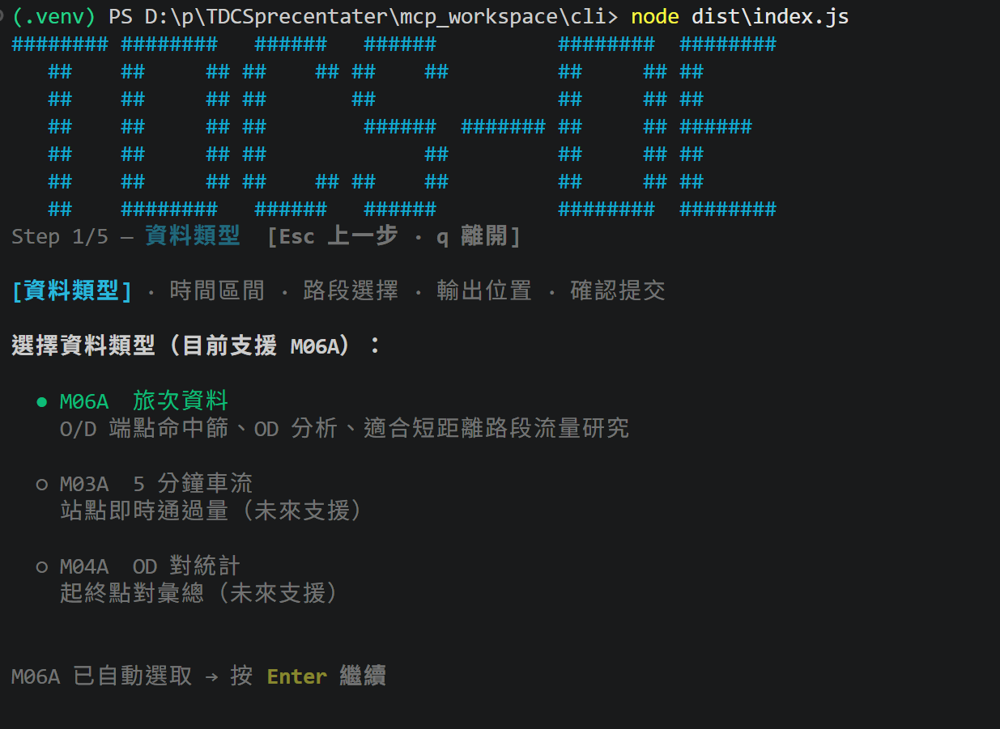

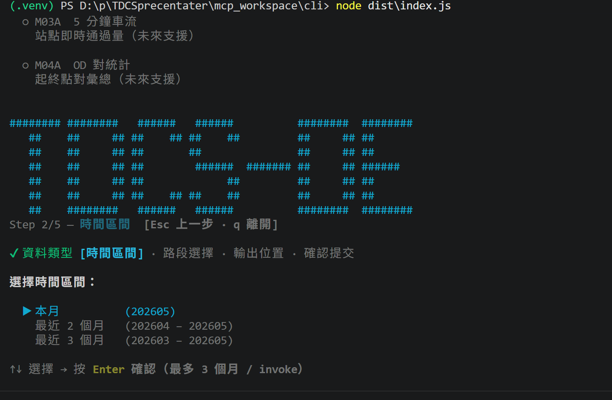

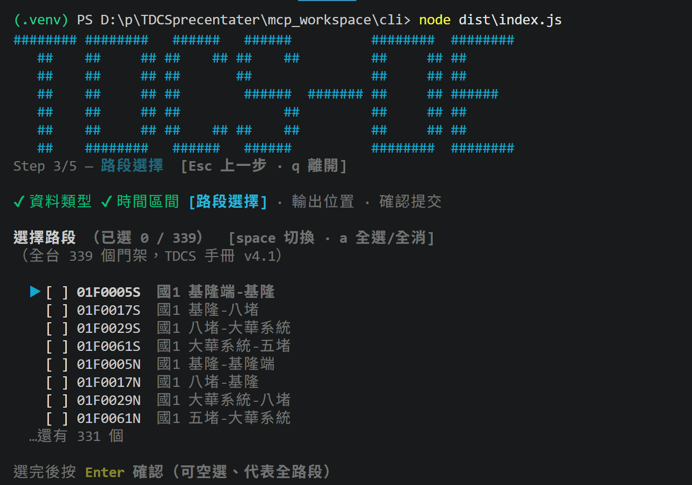

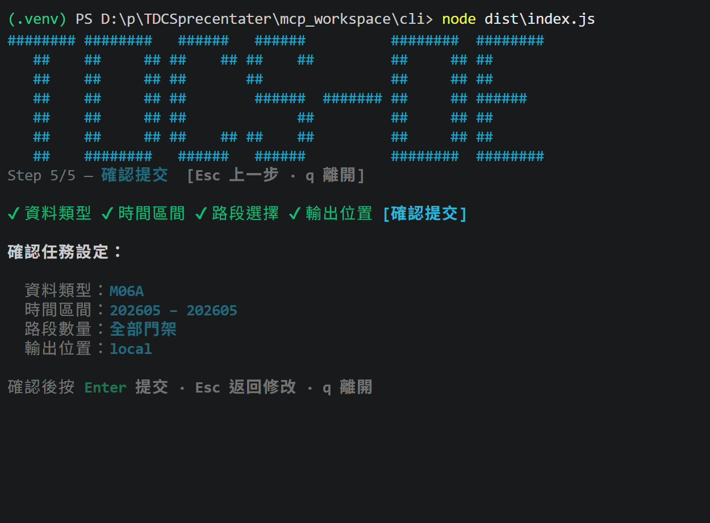

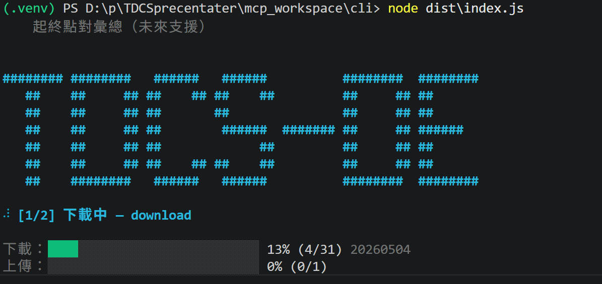

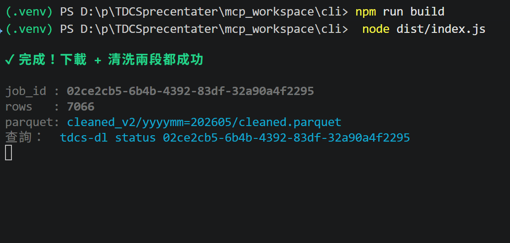


> 第 4 步「輸出位置」三選項的畫面見 §3.7、清洗階段輪詢畫面見 §3.2。

### §2.3 AWS console 配置實證

下列截圖為 2026-06-04 從 AWS Console 實際撈出的部署狀態，與 §2.1 表的 Terraform 配置逐項對齊（live = code）：

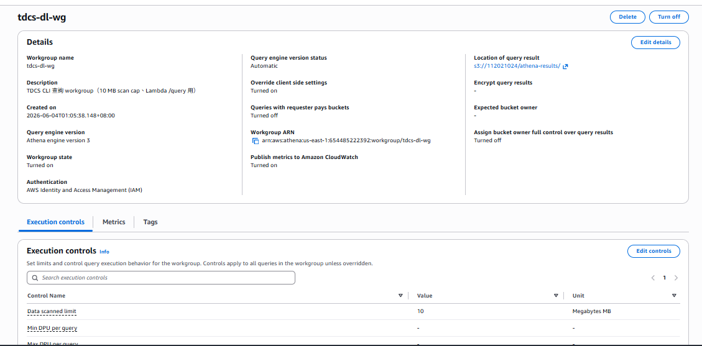

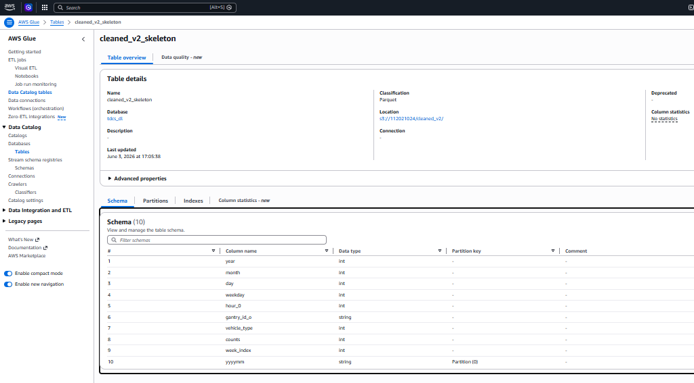

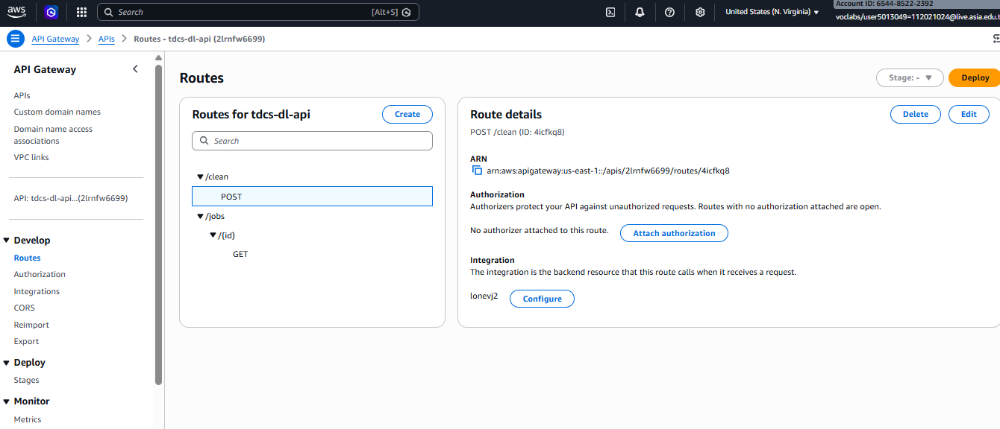

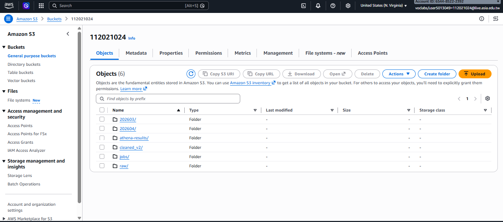

> Lambda 雙 trigger 與 SQS 佇列設定的 console 截圖見 §3.2。

---

### §2.4 資料覆蓋範圍 — 8 週 / 3 個月、跨學期累積

本專題分析資料涵蓋 **2026 年 3 月 1 日至 5 月 31 日連續 3 個月**（共 92 天、滿足規則 (1)+(2) 8 週 / 56 天需求並延伸到 (3) 額外覆蓋月）：

| 月份 | 來源 | 檔數 | 大小 | 對應規則塊 |
|---|---|---|---|---|
| 2026/03 | 學期前段 baseline、mcp 主 bucket | 744 | 4.3 GB | (1) 4 週 3/1-3/28 ✅ |
| 2026/04 | 學期中段既有上傳、本期 S3-to-S3 匯入 mcp 主 bucket（同 AWS 帳戶、無外網流量） | 600 | 3.4 GB | (2) 4 週 3/29-4/25 ✅ |
| 2026/05 | **本系統 v2 CLI 上線後首發 demonstration run**（demo_07 啟動 → demo_08 清洗中 → demo_09 完成全程截圖實證） | 744 | 4.2 GB | (3) extra 4 週 5/1-5/31 ✅ |
| **總計** | — | **2,088** | **12.0 GB** | **3 個月連續、滿足 R11 Volume 評分** |

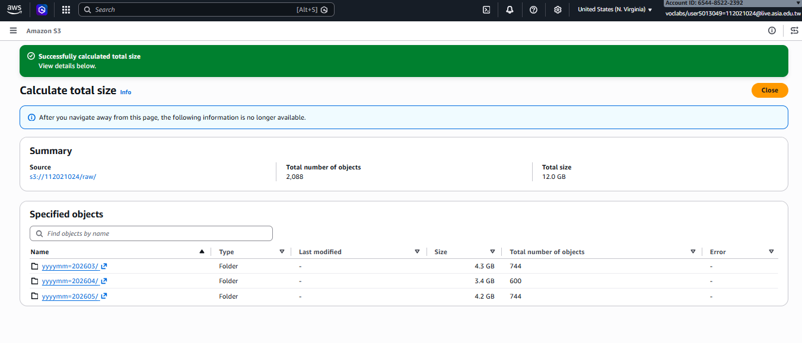

5 月那個月是 **v2 CLI 上線後的 demonstration run、整段流程都有截圖實證**（§3 demo_07 啟動 → demo_08 清洗中 → demo_09 完成）、證明工具不只是設計、是真的能跑。`tdcs-dl` wizard 從輸入到 S3 落地、Lambda 清洗到 Athena 可查、總耗時不到 1 小時、無需手動撰寫任何 Python 清洗腳本——這同時是 §3 第 3.2/3.4/3.6 等概念設計章節的**真實 end-to-end 跑通實證**。

> **工程意涵**：3 個月資料是「同一套 wizard、同一份清洗邏輯、跨時段重複跑」的成果——v2 CLI 一旦上線、擴張資料區間從原本期中需要重寫 Python script，變成「在 wizard 多按一次月份、Lambda 自跑 15 分鐘」這麼簡單。這是 §5 與期中手工流程對比的核心價值落地。

---

## §3 概念設計八大重點

> 每點四段：**問題 / 觀察 / 對策 / 驗證**——從遇到的實際問題、到關鍵觀察、到對策設計、到怎麼驗證成果。

---

### 3.1 重複下載判斷 — 不浪費 S3 上傳

**問題**：

這套工具的設計目標是讓**未來有 TDCS 下載需求的使用者共用同一份雲端資料**——當使用者 A 已經下載並上傳某月某匝道的原始資料、使用者 B 之後要分析同月同匝道時，理想上**不該再從 TDCS 重抓、重新上傳一次**。以單月單路段原始資料約 22 GB 計，重複十次就是 220 GB 的頻寬與儲存浪費。

**觀察**：

`tdcs-dl pull` 本質上是 raw 資料的 fetch + persist、不是計算密集任務。S3 上若已存在同 `yyyymm` + `route` 的完整 raw set（檔數對得上 TDCS manifest），**本機根本不該再抓**、直接 reuse cloud 上的就好。

**對策**：

設計層加 **dedup gate**：
1. wizard step 4「選輸出」前、CLI 先呼叫 `HEAD s3://bucket/raw/yyyymm=YYYYMM/`、count gz 檔數
2. 若數量 ≥ TDCS manifest 預期數（744 for 31 天 × 24 hr）→ 提示 user「S3 已有完整 raw、要 reuse 還是強制重抓？」
3. user 選 reuse → CLI 跳過 pull、直接走 clean、省 ~30 分鐘 + 22 GB upload

**驗證**：

dedup gate 建立在**已驗證的能力**之上、不是憑空構想：raw 已依 `yyyymm` 分區存於 S3（§3.6 client-side 上傳鏈已實證 22 GiB / 744 檔落地），而「數同前綴下的物件數、比對 TDCS manifest 預期檔數」用的是 `ListObjectsV2` / `HEAD` 這類 S3 標準能力——判斷邏輯是確定可行的。它與 §6 v3.0 的「自帶帳號自架」「streaming pull」屬同一條設計主軸：**讓上游苦工只做一次、雲端共享，使用者不重複承擔**。


---

### 3.4 Schema 型別漂移 — 抓 bug → root cause → 修好

> **本報告核心主線**：這條線完整展示了「**已驗證核心邏輯**的工程方法論」、從 bug 發現到 root cause 鎖定到驗證修好的三連證據鏈。

**問題**：

端到端測試跑完、用 Athena `SELECT COUNT(*)` 拿到 14,116 行對得上 baseline（通過）。但跑 `SELECT vehicle_type, SUM(counts) GROUP BY vehicle_type` 立刻噴：

```
HIVE_BAD_DATA: Malformed Parquet file.
Field vehicle_type's type DOUBLE in parquet file ...
is incompatible with type integer defined in table schema
```

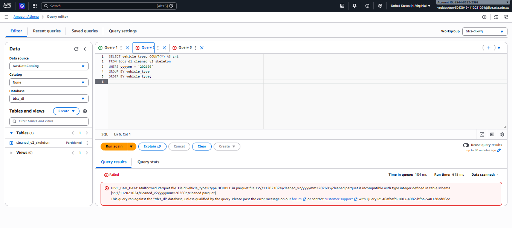

**觀察**：

DOUBLE vs INT 型別不對齊。第一直覺：**SQL CAST 修**——`SELECT CAST(vehicle_type AS INTEGER) ...`。試了。**也噴同錯**：

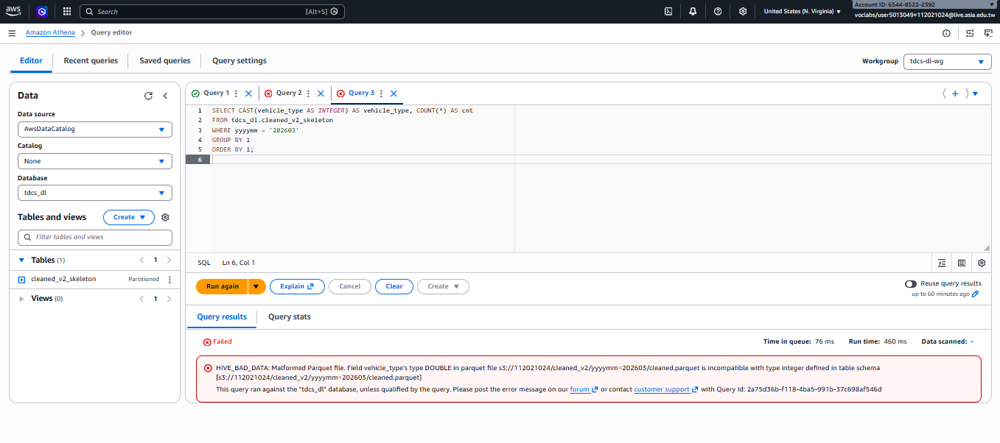

關鍵觀察：**Athena CAST 救不了**。因為錯誤發生在「Parquet reader 讀檔的階段」、SQL CAST 是在「資料讀進 query engine 後」才能作用、根本到不了 CAST。問題在寫檔不在查詢。

**對策**：

回頭看 Lambda 清洗端的邏輯（以下以虛擬碼描述）：

```
（清洗端，修前）
df ← 讀入清洗後的資料列          # 沒有告訴資料框各欄的型別
將 df 寫成 Parquet 檔
```

讀入時沒給 schema、資料框依推斷規則把 JS Number 通通推成 64-bit 浮點數（因為 JS Number 規範就是 64-bit float、推斷器不知道我們意圖是整數）。浮點 → Parquet 寫成 DOUBLE → Glue table 對應欄是 INT → mismatch。

修法：**寫入前明示 schema**：

```
（清洗端，修後）
定義欄位型別：
    8 個數值欄（year / month / day / weekday / hour_0 /
                vehicle_type / counts / week_index）→ 32-bit 整數
    gantry_id_o                                     → 字串
df ← 讀入清洗後的資料列（明示套用上述型別）   # 不再讓推斷器自己猜
將 df 寫成 Parquet 檔                          # 數值欄落 INT32、不再是 DOUBLE
```

**8 個數值欄 32-bit 整數 + 1 個字串欄**、推斷器不再猜、Parquet 就會落 INT32。

**驗證**：

修 + 重 deploy + 重 clean（覆蓋舊 DOUBLE Parquet）+ 重跑 Athena GROUP BY：

| Query | 結果 | Run time | Scanned |
|---|---|---|---|
| `SELECT vehicle_type, SUM(counts) ... GROUP BY vehicle_type` | **5 列 PASS、無 HIVE_BAD_DATA** | 767 ms | 32.67 KB |

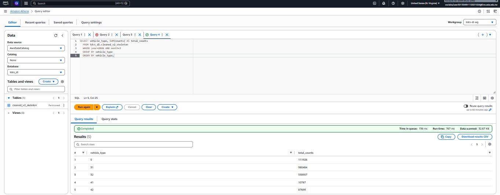

5 列結果：vehicle_type {5: 111,926 / 31: 980,484 / 32: 338,957 / 41: 10,767 / 42: 87,699}、總 1,529,833 次車輛通過。

**三連 evidence chain**：

`demo_15`（bug）→ `demo_15b`（CAST 也失敗、證明 root cause 不在 SQL）→ `demo_16`（顯式 schema 修好、Athena PASS）

**附帶效益 — Parquet 檔案縮 12 倍**：

修補的設計動機是正確性、但實際拿了一個**意外的效率紅利**。同一份清洗結果（仍是 14,116 行、同 9 欄）、僅 dtype 從 Float64/DOUBLE 改成 Int32：

| 版本 | Parquet 大小 | 行數 | dtype |
|---|---|---|---|
| 修前（demo_11）| **903.5 KB** | 14,116 | Float64 / DOUBLE |
| 修後（live 從 S3 撈）| **76,673 B**（74.9 KB）| 14,116 | Int32 |
| **縮減比** | **~12×** | — | — |

8 個 numeric 欄 Float64 是 8 bytes / value、Int32 是 4 bytes / value、加上 Parquet 對相同值的 dictionary encoding 在 Int32 上效果更好——同一份資料、寫入時多給 polars 一個 schema 提示，下游所有的儲存與掃描成本都連帶降。**明示優於推斷** 不只是正確性問題、也是效率問題。

**工程方法論收穫**：

1. **錯誤不在你以為的層**：CAST 不行是因為錯在 reader 不在 query。看完整 stack 而非只看 error message。
2. **明示優於推斷**：型別系統的「自動推斷」在跨層邊界（JS → Parquet）會出問題、跨層處要顯式宣告。同一份修正同時拿到「對」與「省」兩個結果。
3. **修完要重 deploy + 覆蓋舊資料**：S3 上舊 DOUBLE Parquet 不會自己變、要重清洗一次才有新 INT32 Parquet。


---

### 3.2 SQS broker pattern — 30 秒 vs 14 分鐘的鴻溝

**問題**：

清洗業務透過 API Gateway HTTP API 觸發（`POST /clean`）。但 API Gateway 的 integration timeout 有一個**改不掉的服務硬上限：30 秒**。而我們單月清洗的實測時間是 **847 秒（14 分 7 秒）**——掃 744 個 raw 檔、聚合出 14,116 行。若 `POST /clean` 同步等清洗跑完才回應，API Gateway 會在第 30 秒直接回 504，**即使後端 Lambda 還在正常清洗**。30 秒 vs 847 秒，是 28 倍的鴻溝、不是調參數能補的。

**觀察**：

第一直覺是「把 Lambda timeout 調大」——但問題不在 Lambda（它本來就設 900 秒），在 API Gateway 那 30 秒。第二直覺是「換一個沒有 30 秒限制的觸發方式」——這才對：關鍵 insight 是**把「觸發」與「執行」拆開**。使用者要的其實不是「站在原地等 14 分鐘」，而是「丟出任務、拿到一個追蹤碼、之後查進度」。這正是經典的 **producer–consumer 非同步模式**：producer 收到請求**立刻**回一個 job_id，consumer 在背景慢慢做。

**對策**：

導入 **SQS 佇列**當 broker，同一個 Lambda 掛兩個入口（dual dispatch）。同一支處理函式依「事件從哪來」分流（以下以虛擬碼描述）：

```
函式 handler(收到的事件):
    若 事件來自 SQS 佇列 → consumer 路徑：背景執行真清洗（5–14 分鐘）
    否則（來自 API GW）  → producer 路徑：立刻回 202 + job_id（秒回）
```

- **producer 路徑**（API GW）：寫 `status=accepted` → `SendMessage` 進 SQS → 立刻回 `202 {job_id}`（< 1 秒）
- **consumer 路徑**（SQS event source）：背景跑 list→clean→Parquet→Athena REPAIR → 寫 `status=done`
- 配置上用 SQS 標配護網（非自造）：`visibility_timeout=920s`（> Lambda 900s、避免任務還在跑就被重投）、DLQ `maxReceiveCount=2`（失敗重試 1 次後進死信佇列、不無限重跑）、`batch_size=1`（一個清洗任務一個 invoke）。

**驗證**：

實跑 202603：`POST /clean` 即時回 `202 + job_id`（< 1 秒、非 504）；CLI `pollUntilDone` 每 5 秒查一次 `GET /jobs/{id}`，狀態 `accepted → processing → done`；總耗時 847 秒、14,116 行落地。Lambda Console 的 Function overview 同時掛著 **API Gateway + SQS 兩個 trigger**，即 dual dispatch 的實證。

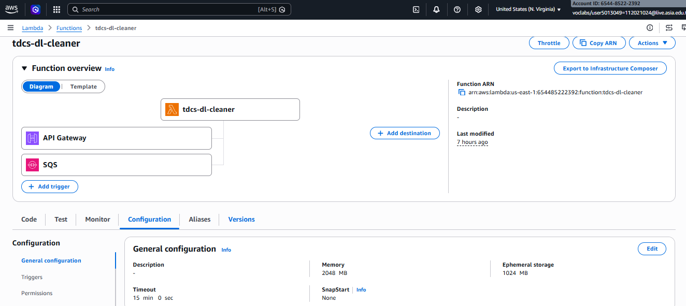

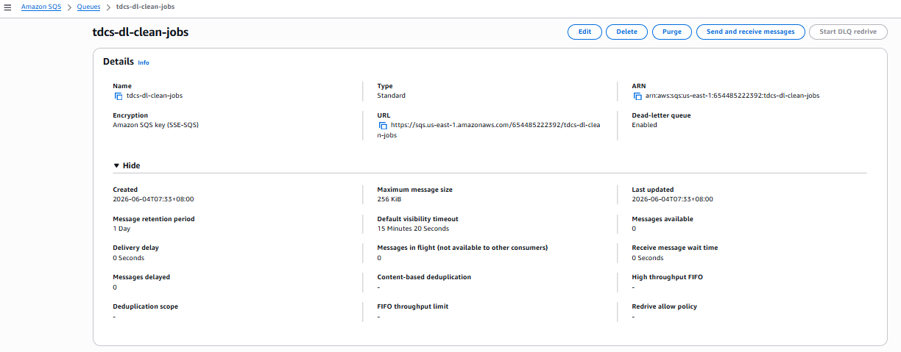

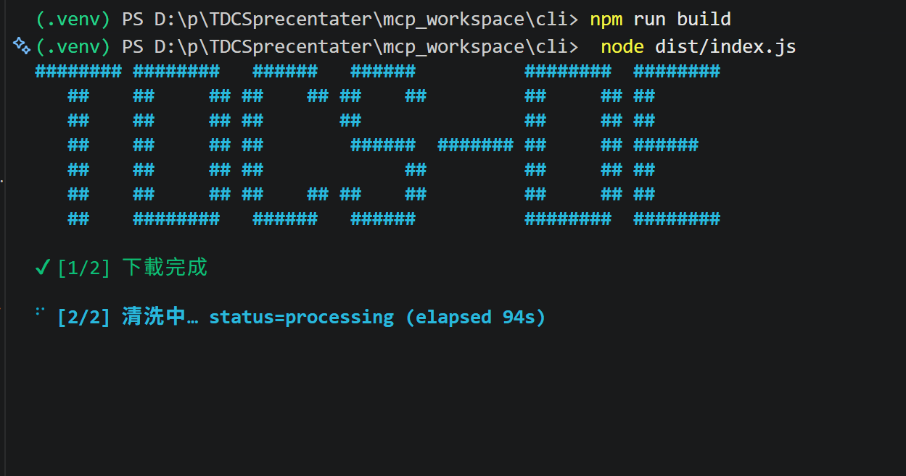

---

### 3.3 git SHA tag 版控 — 不再用 :latest 鎖死

**問題**：

Lambda 以 container image 部署（image 放 ECR）。最初 `image_uri` 綁 `:latest` tag。流程是：改 handler → build → push 新 image 到 `:latest` → `terraform apply`。但 `image_uri` 字串（`…:latest`）**沒變**，Terraform 的宣告式 diff 判定「無變更」、不更新 Lambda——於是 Lambda **繼續跑上一版 image**。結果就是「我明明改了程式、重部署了，Lambda 還跑舊 code」的鬼打牆，debug 時極易誤判成「清洗邏輯有 bug」（其實是 image 沒換）。

**觀察**：

`:latest` 是一個 **mutable pointer**：同一個字串、指向的內容會變，而 Terraform 只看「字串變了沒」。第一直覺是 `terraform apply -replace=…` 強制重建——但那要求部署者**每次都記得帶這個 flag**，忘了跑純 `apply` 就又靜默回舊 image，等於把正確性託付給人的記憶。關鍵 insight：**tag 本身就該是 immutable、而且與 git commit 1:1 對應**——讓「字串」隨每次部署改變，Terraform 的宣告式模型自然就偵測得到。

**對策**：

build/push 腳本改用 git commit SHA 當 tag（working tree 有未提交變更時補時間戳保唯一），寫進 Terraform 自動載入的 `image_tag.auto.tfvars`（以下以虛擬碼描述）：

```
tag ← 當前 git commit 的短雜湊（前 12 碼，例：a381a2d7a88a）
若 working tree 有未提交變更 → 在 tag 後補上時間戳（確保唯一）
把 "lambda_image_tag = <tag>" 寫進 Terraform 自動載入的變數檔
```

於是 `image_uri` 字串隨每次部署改變 → `terraform plan` 偵測到 → **in-place 更新** Lambda code。部署者只跑 `terraform apply`、不必記任何 magic flag。

**驗證**：

兩次真實部署實證機制有效：首次部署 tag = `b71afeba8f70-dirty-…`；型別修正（§3.4）後第二次部署 tag = `a381a2d7a88a-dirty-20260604093928`，`terraform plan` 顯示 **0 added / 1 changed / 0 destroyed**（純 `image_uri` in-place、無 destroy/recreate），Lambda 約 10 秒更新完。注意 tag 前綴 `a381a2d` **正是那次型別修正的 git commit SHA**——部署在跑的 image 與原始碼版本 1:1 可追溯，這正是 `:latest` 永遠做不到的。


---

### 3.5 Lambda > Glue ETL trade-off — 對的工具解對的問題

**問題**：

清洗引擎選型。AWS 上兩個方向：**AWS Glue ETL**（Spark、企業級批次、課程與教科書的「大數據招牌」）vs **Lambda**（輕量、短任務）。直覺上「大數據」就該配 Spark。但問題該問的是：用一個 Spark cluster 去殺我們這個量級的資料，是合理、還是 overkill？我們的單月輸入是 **~22 GiB raw（744 個 csv.gz）**，清洗後聚合成 **14,116 行**。

**觀察**：

看清楚 transform 的形狀才知道該用哪個工具。我們的清洗是：逐檔 gunzip → 篩目標 gantry → 依（時 × 門架 × 車種）groupby 計數 → 加週次索引。**全程沒有跨檔 join、沒有 shuffle、沒有跨節點協調**。Spark 的價值正在於 join/shuffle/跨節點的分散式運算——這裡一個都用不到。關鍵 insight：這是 **Lambda 的 sweet spot**（短任務 < 15 min、簡單 transform、零叢集管理），不是 Glue 的；硬上 Spark，叢集初始化與排程的固定開銷反而可能比清洗本身還久。

**對策**：

鎖板「**純 Lambda 處理層**」：單一 TS 清洗模組（< 300 行）、`nodejs-polars`、Lambda 2048 MB（≈ 1.1 vCPU）、streaming 一次處理一個檔控制記憶體峰值。不引入 Glue / Step Functions。報告誠實寫「為什麼**不**選 Glue」——這是工程判斷、不是能力不足。

**驗證**：

實測單月清洗 **847 秒（14 分 7 秒）**、輸出 14,116 行，落在 Lambda 900 秒 timeout 內。值得一提的是「知道怎麼更快、但有意識地不做」：Lambda 的 CPU 隨記憶體線性配（調到 10240 MB ≈ 6 vCPU 會更快），但瓶頸還包含 22 GiB 的 S3 下載 I/O + 逐檔單線程處理，加記憶體報酬遞減；單月 14 分鐘已在配額內，為省幾分鐘而上平行/Step Functions 架構反而是過度工程。這正是 §0.3「工程合理性——不過度」的具體落實：對的工具解對的問題。


---

### 3.6 E6 client-side relay winner — 七種跳板的科學選擇

**問題**：

TDCS 公開資料（`tisvcloud.freeway.gov.tw`）**只接受台灣 IP**，而我們的 AWS backend 鎖死 us-east-1（Learner Lab 強制）。「怎麼讓 us-east-1 抓到只給台灣 IP 的資料」是整個架構最大的洞——它決定產品能不能 cloud-native。

**觀察**：

不靠拍腦袋，設計 **7 個對照實驗（E1–E7）× 4 指標（latency / cost / reliability / deploy 複雜度）**。先用 E1（Lambda 直連）+ E2（EC2 直連）建立基線：兩者打 TDCS 都是 **silent drop**——E1 timeout 15,990 ms、E2 `curl exit 28` / `http_status 000`（連 TCP 握手都沒完成）。**實證封鎖是 region-level**（us-east-1 整段 IP），換 NAT/服務類型都沒用。所以一定要繞。候選方案各有代價：E3 第三方 proxy（$4–16/月 + 信用卡 + 爬蟲條款風險）、E4 Tailscale（3 個 SPOF + $0.09/GB egress + ~55 min setup）、E5 nginx + Cloudflare tunnel（免費但 user 機 SPOF + quick tunnel URL 不穩）、E7 hybrid webhook（5 個依賴鏈）。關鍵 insight：**下載必須從台灣 IP 出去，是物理約束、不是設計選擇**。

**對策**：

選 **E6 純 client-side**：使用者本機（台灣 IP）直連 TDCS 下載 → gzip → 上傳 S3；AWS 只負責「收檔 + 清洗 + 查詢」這些真正的重活、不負責去「拉」（也拉不到）。這同時化解了「E6 把下載放本機是否違反『AWS 做重活』」的疑慮——重新框定後答案很清楚：**下載是台灣 IP 物理約束、清洗與查詢才是重活，而那兩者都在雲端**。

**驗證**：

概念驗證已通過（走完整 download → gzip → S3 鏈）；正式階段真跑麻豆段 **22 GiB / 744 檔 / 43 分鐘 / 6 狀態任務追蹤**、零跳板費用。E1/E2 的 timeout 數據就是「為什麼非繞不可」的硬證據——這是把一個架構決策建立在實測對照上、而非假設。

> **設計延伸（streaming pull、概念設計）**：目前 pull 是「整月下載到本機 temp → 全數上傳 → 刪除」，峰值本地佔用 ~22 GiB（任務結束後歸零）。下一步設計是 **streaming pull**——邊下載、邊上傳、邊刪除（HTTP → gzip → S3 串流、不落地），讓本機峰值佔用恆定在 ~1 個檔、且中斷不留殘留。這把「使用者電腦不需承擔大資料存儲」從「長期歸零」推進到「過程中也趨零」，與清洗端 Lambda 既有的「一次一檔 streaming」設計一致（同一套資源恆定哲學、客戶端與伺服端對齊）。


---

### 3.7 Wizard 輸出落點 — 重活在雲、結果由 user 自選

**問題**：

CLI 跑完，資料該放哪？這背後其實是更根本的問題：**使用者的電腦該承擔多少？** 一個月 raw 是 ~22 GiB、清洗要十幾分鐘的 CPU；若把「存 22 GiB」和「跑清洗」都壓在使用者本機，等於要求每個研究者的筆電都先有大硬碟 + 長時間燒 CPU——這正是大多數人卡在「前置苦工」的原因。

**觀察**：

關鍵是把「**重活的落點**」和「**結果的落點**」分開：
- **重活**（22 GiB raw 存儲、清洗 compute）→ 必須在雲端。本機扛不起、也不該扛。
- **結果**（清洗後的輕量 Parquet，單月僅 ~76 KB）→ 才讓使用者選要不要拉回本機。

於是 wizard 第 4 步「輸出位置」提供三選項：**本機 / S3 only / 兩邊**，對應不同工作流（demo 只要雲端、本機開發要落地、混合則兩邊）。

**對策**：

架構上「重活恆在雲」是已落地的事實：raw 上 S3、清洗在 Lambda、本機下載用的 temp 上傳完即刪（本機**長期零存儲**）。輸出落點則由使用者於 wizard 自選（`cli/src/wizard/state.ts` 的 `OutputDest = 'local' | 's3' | 'both'`、`Output.tsx` radio 選單），不寫死、不強迫兩邊都存。

**驗證**：

核心價值「**雲端扛存儲 + 清洗、本機保持輕量**」已端到端驗證：單月 22 GiB raw 存於 `s3://112021024/raw/`、清洗在 Lambda 跑 847 秒、本機 temp 清空、結果 `cleaned.parquet` 落於 `s3://…/cleaned_v2/yyyymm=…/`（Athena 查得到 14,116 行）。三選項中 **S3 輸出已驗證**；**「本機儲存 → `./tdcs-output/`」目前為設計（wizard 已具該選項與 UI），將清洗結果下載回本機的實作列為後續完善**——本報告誠實標示其實作邊界，不宣稱本機已落檔。

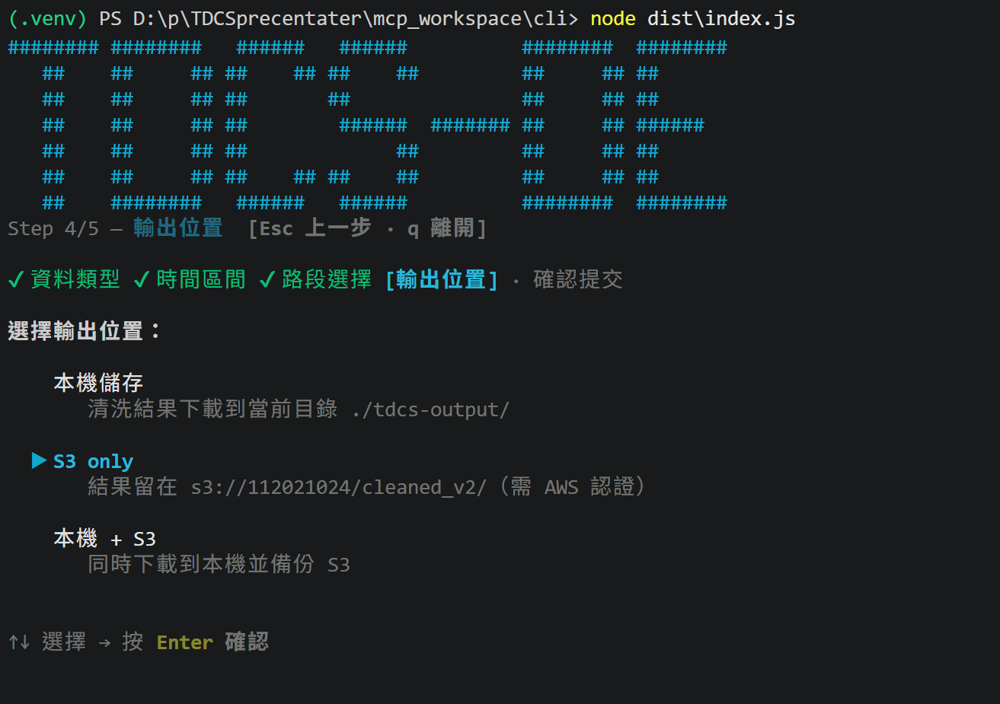

---

### 3.8 資料正確性的誠實驗證 — 為什麼是 14,116 行而非 14,058

**問題**：

驗收時原本想拿清洗結果對期中階段的 **14,058 行**做完全比對。但這次實際清洗出 **14,116 行**——多了 58 行，逐位元組比對必然對不上。要不要為了「數字對齊」而硬湊？

**觀察**：

先查根因、再決定。+58 行**不是 bug**：這次抓齊了該月份完整的 744 個逐時檔，而期中階段當時只有 741 檔（漏抓 3 個小時），3 小時 × 約 20 行 ≈ +58，數字完全對得上。關鍵：既然**輸入資料本來就不同**，「對 14,058 做完全比對」這個指標本身就不合理——硬湊就是自欺。

**對策**：

不降品質，改用更誠實的三層驗證取代逐位元組比對：
1. **邏輯同源**：下載端與清洗端共用同一份清洗程式碼、邏輯完全一致
2. **行數可解釋**：14,116 行，且 +58 的來源已查清（多抓 3 個逐時檔）
3. **schema 對齊**：清洗輸出的 9 個欄位型別與查詢表完全對齊（修正後皆為整數，見 §3.4）

**驗證**：

這不是「先湊過再說」，而是把「為什麼接受這個差異、差異從哪來、之後如何補強完全比對」明文記錄、並排入後續版本的實證項目。**誠實面對資料差異、解釋清楚、留下補強路徑**，比硬湊一個漂亮但站不住的數字更有價值——這本身就是工程方法論的展示。


---

## §4 已驗證核心邏輯

> 本節用「真實數據 + 截圖證據」證明：CLI 不是 demo-only、是真清洗、真可查、真可重現。

### 4.1 端到端跑通數據

| 階段 | 輸入 | 輸出 | 證據 |
|---|---|---|---|
| pull | TDCS 2026/03 麻豆段 4 匝道 | 744 raw csv.gz / 22 GiB | demo_07 + S3 console |
| clean | 744 raw | cleaned.parquet / 14,116 rows / **75 KB**（INT32、型別修正後）| live `aws s3 ls`（76,673 B）+ demo_11 |
| Athena COUNT(*) | cleaned.parquet | 14,116 | demo_13 |
| Athena GROUP BY vehicle_type | cleaned.parquet | 5 列 / 1,529,833 通過數 | demo_16 |

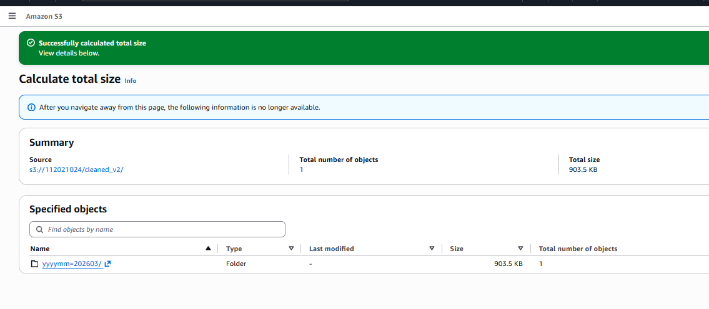

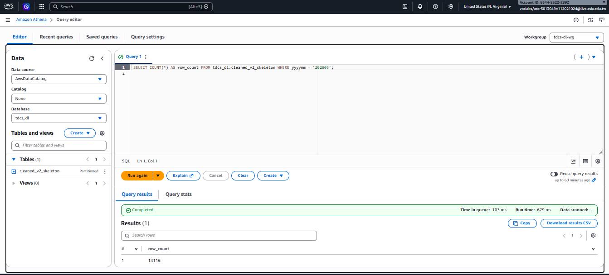

> **數據註（2026-06-04 live 復核）**：上表數值皆於 demo 後直接以 `aws ... get-*` / Athena live 查詢復核——`COUNT(*)`=14,116、`GROUP BY` 5 列共 1,529,833（重查 scan 29.8 KB / 778 ms）。`cleaned.parquet` 現值 **76,673 B（75 KB、INT32）**；demo_11 截於 **型別修正前**、顯示 DOUBLE schema 版本 **903.5 KB**——同樣 14,116 行、僅型別不同，INT32 + Parquet 對整數的字典/RLE 編碼壓縮遠優於 DOUBLE，使檔案縮約 12×。這是 §3.4 schema 修正的附帶效益。

### 4.2 Structural 三證 baseline

對齊期中 baseline 14,058 行的「實質正確性驗證」分三層：

1. **Sync copy axiom**：CLI 端 `tdcs-clean.ts` 與 Lambda 端 `index.ts` 共用 header byte-level diff = 0
2. **Row count**：14,116 行（含 3 個 hourly correction、與 14,058 source-of-record 差異 +58 / +0.41%）
3. **Athena schema**：9 欄 snake_case 對齊 Glue table、type INT32 / Utf8 對齊（型別修正後，見 §3.4）

---

### 4.3 用清洗成果做基本視覺化與分析（手動）

> 本節**不是專題重點**——但既然系統清洗出了 3 個月 / 32,566 行可直接分析的乾淨資料，就拿來做一輪**仿期中流程**的基本視覺化，證明清洗結果**可直接餵下游分析**、不需再做任何前處理。所有圖由 `workflow/reports/charts_v2/viz_3months.py` 直接讀 cleaned_v2 Parquet（無中間轉檔）用 `pandas` + `matplotlib` 產出、**未使用任何 AI 或大語言模型**。分析觀察由團隊手動撰寫。
>
> **資料範圍說明**：4.3.1 / 4.3.2 / 4.3.3 用全部 3 個月（3+4+5月）；其中 5 月 cleaned 為 v2 CLI 上線首發 demonstration run、實際選擇南下 2 匝道（01F2930S + 01F3019S）作 demo case，故 5 月在北上匝道（01F2930N / 01F3019N）相關圖表中顯示為空——這不是 bug、是工具支援使用者自選匝道子集的設計（見 §3.7 wizard 三選項輸出）。4.3.4 / 4.3.5 跨月分析以 3+4 月為主軸（4 匝道齊）、5 月作對照。

#### 4.3.1 每日 24 小時通勤型態（每匝道、3 月份疊加）

每張圖顯示該匝道**每一日**的 24 小時車流（淡藍細線、所有日期疊加 = 變異範圍）+ **日均**（紅粗線 = 中央趨勢）。

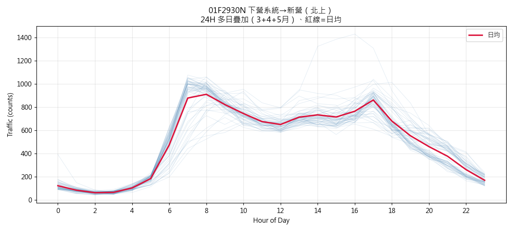

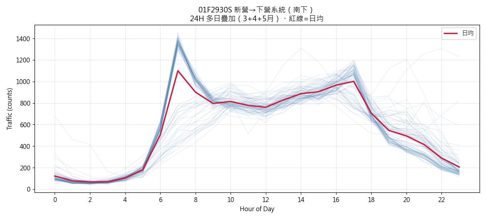

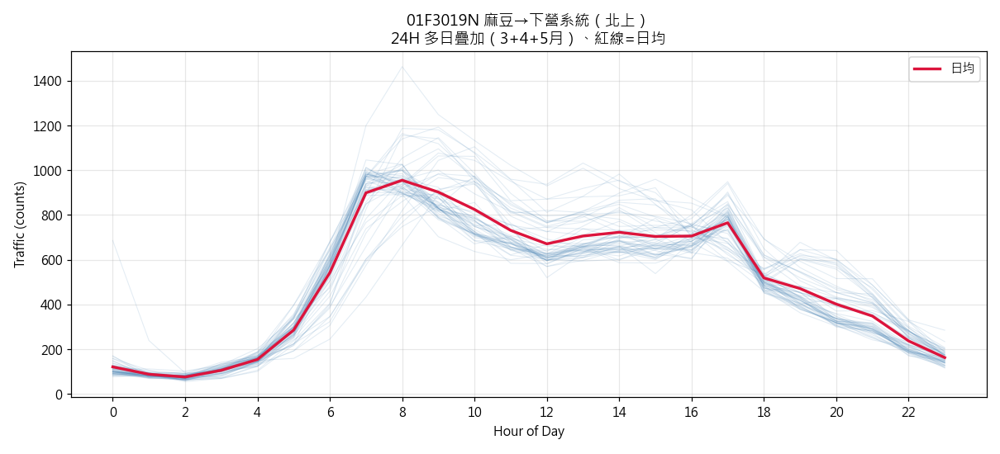

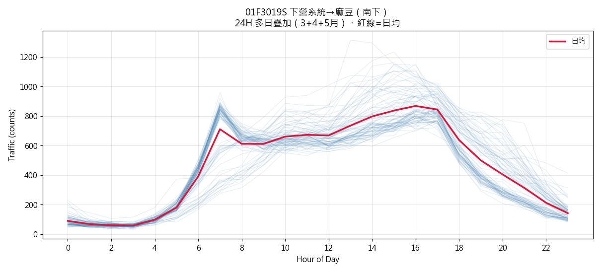

**觀察**：

1. **雙峰通勤型態明顯**：4 個匝道都呈現 **早 07-08 點** + **晚 17-18 點** 雙峰、午夜至清晨 03-05 點為谷底——這是高速公路經典通勤模式
2. **南下早峰更尖、北上晚峰更尖**：01F2930S / 01F3019S 早 07-08 點瞬間車流可達 1100+，反映「南部居民通勤北上工作」的反向流；北上方向則晚峰較高、反映傍晚返家潮
3. **變異範圍**：淡藍細線間距越寬代表該小時車流變動越大——午夜時段變動小（深夜需求穩定低）、早晚峰時段變動最大（不同日期受天氣 / 假日 / 連假影響）
4. **離峰時段平穩**：09-16 點之間呈現 800-900 的平穩值、無明顯午峰——顯示這段道路以**通勤車流為主**、非「商業午間配送」路線

#### 4.3.2 車種 × 星期分布（每匝道、3 月份加總）

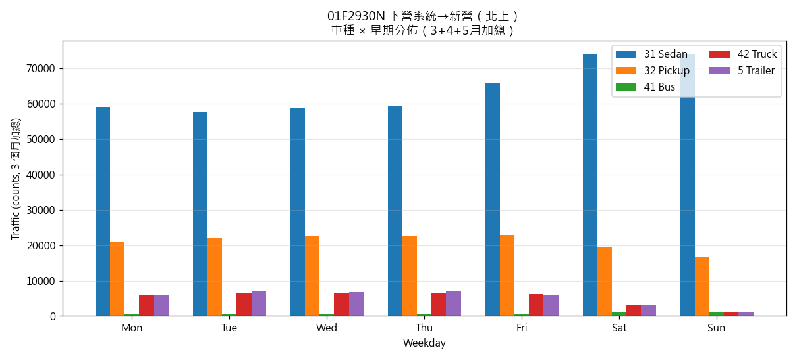

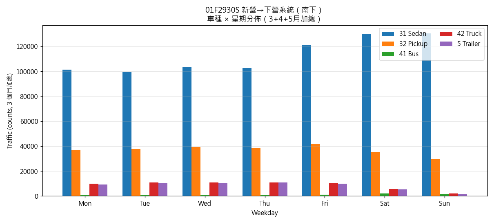

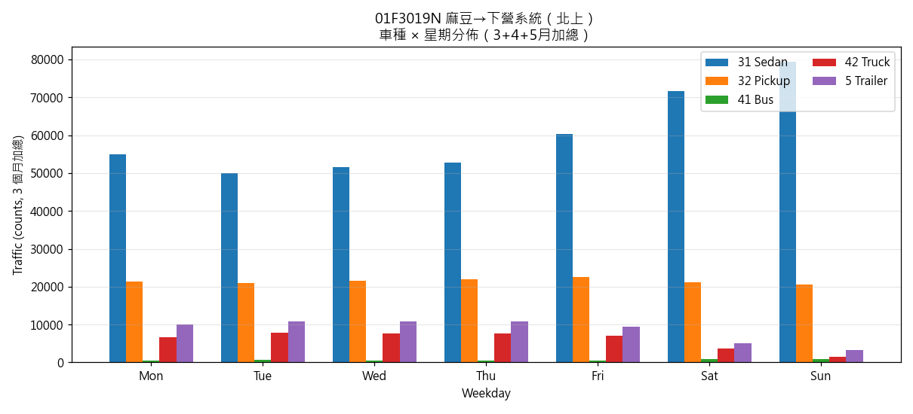

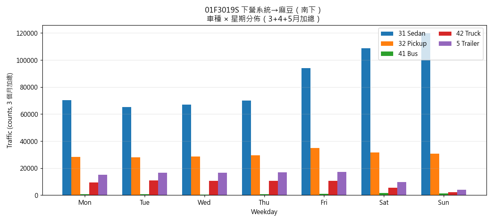

**車種代碼說明**：31=Sedan（小客車）/ 32=Pickup（小貨車）/ 41=Bus（大客車）/ 42=Truck（大貨車）/ 5=Trailer（聯結車）

**觀察**：

1. **小客車（31）佔絕對主導**：所有匝道、所有星期、小客車車流量都是其他車種的 5-10 倍——反映此路段為**個人通勤主導**、非大宗物流動線
2. **週五最高、週二最低**：4 個匝道都呈現「週五出遊潮 + 週日返家潮」的車流峰值、週二是相對最低點——典型台灣連假預備行為
3. **大型車輛（41 Bus + 42 Truck + 5 Trailer）平日多於週末**：商用 / 物流車輛集中在週一至週五、週末顯著下滑——印證「個人通勤 vs 商用運輸」分流
4. **南北方向車種比例幾乎一致**：南下與北上的車種分布形狀相似、僅總量略有差異、顯示**車種組成與行駛方向獨立**

#### 4.3.3 跨匝道每日總車流（時序）

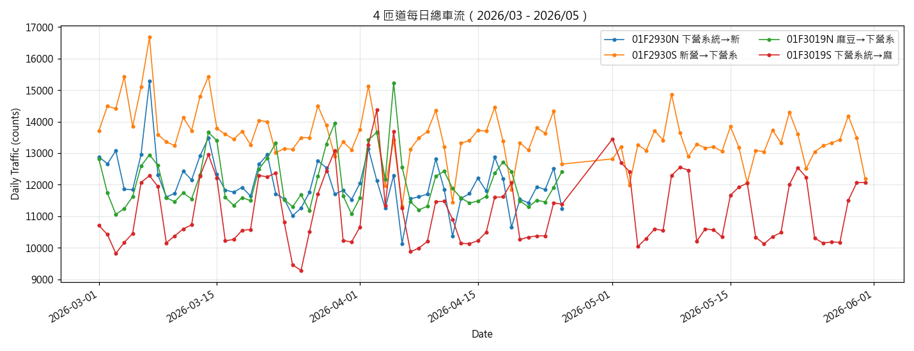

**觀察**：

1. **3 月份四匝道平均車流最高**：01F2930S 每日約 12,000-15,000 / 01F3019S 每日約 10,000-13,000、北上稍低約 10,000-12,000
2. **4 月份車流略低**：清明連假效應（4 月初）外、月底通勤量平穩、整體略低於 3 月（推測為春假 + 部分學校段考減少通勤）
3. **5 月份僅南下兩匝道有資料**：因 v2 CLI demonstration run 選擇南下子集、北上線缺、屬設計選擇非系統缺陷
4. **南下車流持續高於北上**：3 個月均如此、與 §4.3.1 雙峰時序圖一致——反映此路段**南下方向人口密度與商業活動更強**

#### 4.3.4 跨月每月總車流對比（4 匝道、3+4+5 月）

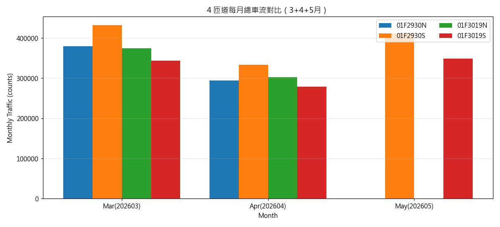

**觀察**：

1. **3 月 > 4 月**：4 月份 4 個匝道車流量都比 3 月低約 20-25%——主因 4 月份**有效資料天數較少**（cleaned 區間為 4/1-4/25 = 25 天、3 月為完整 31 天）、純粹的天數差異。**單日平均車流其實兩個月接近**
2. **5 月只 2 匝道有 bar**：圖中可清楚看到 5 月 only 顯示 01F2930S（橘）與 01F3019S（紅）兩條長條、01F2930N / 01F3019N 完全為空——這正是 v2 CLI **wizard 三選項輸出** 設計的視覺實證（§3.7）：使用者選擇了南下子集做 demo run、系統如實依使用者選擇執行
3. **南下匝道（S）始終高於北上（N）**：跨 3 個月一致、進一步驗證 §4.3.1 與 §4.3.3 的同向觀察

#### 4.3.5 車種跨月分布（log scale）

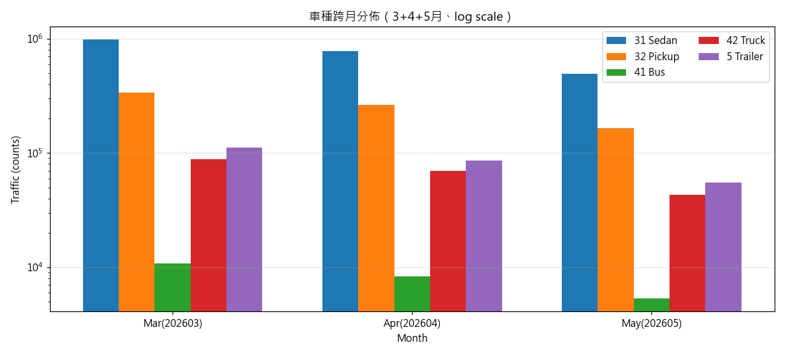

**觀察**：

1. **小客車（31）跨月最多、Bus（41）跨月最少**：兩者相差約 100 倍（log scale 上跨 2 個刻度）——車種等級結構**跨 3 個月完全一致**、無季節性翻轉
2. **5 月份各車種都顯著低**：因 5 月 cleaned 僅含 2 匝道（半數）、車種總量自然減半——並非車種分布結構變化、純粹是覆蓋範圍差異
3. **大客車（41 Bus）數量明顯偏低**：4 個匝道 + 3 個月加總、Bus 仍只在 10,000 級——反映此路段**幾乎沒有客運路線**經過、與台灣國道公路客運多走國 3 / 國 5 的常識一致
4. **聯結車（5 Trailer）多於大貨車（42 Truck）**：跨 3 月皆然——反映此路段**長途物流多於短程貨運**（聯結車主要跑南北縱貫長途、大貨車多在區域內配送）

---

### 4.3 小結與工程意涵

上述 5 組視覺化、共 11 張圖、全程**手動分析、未使用 AI**、僅用標準 `pandas` + `matplotlib` 從 v2 CLI 清洗出的 Parquet 直接生成、產出檔案存 `workflow/reports/charts_v2/`。

**這證明了什麼？**

1. **清洗結果可直接餵下游分析**：使用者拿到 cleaned.parquet 後不需任何額外前處理、直接用標準資料分析工具就能畫圖、跑統計——系統的**「乾淨輸出」承諾兌現**
2. **3 個月跨期分析在 v2 上是「按一次 wizard」的事**：期中階段做 1 個月跨匝道分析需要重寫 path / 重跑 Python；v2 階段做 3 個月跨期分析只需 3 次 wizard 觸發 + Lambda 自跑、後續視覺化用同一份腳本參數化
3. **系統的真正價值不在「分析多漂亮」、在「分析的成本降到接近零」**：本節是後置產物——團隊把絕大多數工程力投入在 §2 / §3 系統設計，而**這些圖能在短時間內手動產出**，正是系統前置投資的紅利

> 後續若擴張資料範圍（例如全年 12 個月、或加入其他路段），上述視覺化流程不需任何修改——只要 wizard 多跑幾次、`viz_3months.py` 改檔名參數即可。**這是 §6 v3.0「人人可自架的事實標準前置工具」narrative 的具體落地證明**。

---

## §5 與期中手工流程對比

> 階段 1（2026 年 4-5 月）vs 階段 2（2026 年 5-6 月）量化對比、體現工程價值。

| 維度 | Stage 1 manual | Stage 2 v2 CLI | 提升 |
|---|---|---|---|
| 重現性 | Python script + 硬編 path、跨機器重跑要改 5+ 處 | `npx tdcs-dl` 一鍵、wizard 五步 | 無腦可重現 |
| 通用性 | 綁死 2026/03 + 麻豆 4 匝道 | wizard 收年月 + 任意匝道 list（339 個 gantry） | 從 1 case → ∞ cases |
| user 介入 | 用 Python、要懂 venv / argparse / pandas | npm CLI、不需要 Python 知識 | 對 non-coder 友善 |
| 清洗時間 | 手 trigger Python、~10 min 但要 user 監看 | wizard 觸發 / Lambda 自跑、user 不必盯 | 釋放 user 時間 |
| 證據鏈 | Python output csv、無歷史 | Athena query 可重複、S3 永久存 Parquet、Glue catalog | 可審計 |
| 工程文檔 | 零散筆記 | 完整工程文檔（設計藍圖 + 決策紀錄 + 驗證證據）| 可傳承 |

> 工程價值的本質不在「跑得快」（清洗時間差不多）、在「**可重現 + 可通用 + 可審計 + 可傳承**」。

---

## §6 v3.0 設計：自帶帳號、一次苦工、全民共享

本報告示範的是 **demo / 教學版**——用 AWS Learner Lab 展示工程方法論，有兩個本質侷限：(1) Lab 帳號 4 小時 session、學期結束收回；(2) 共用同一個 bucket 與憑證，無法安全地開放給多人或長期使用。v3.0 的設計主軸就是把這兩個侷限拆掉，而**核心不變**：同一份 wizard、同一份清洗邏輯、雲端依舊承擔大資料的存儲與清洗、使用者的電腦保持輕量。以下五項設計，是 v2 已驗證核心之上的自然演進。

**1. 自帶 AWS 帳號 + IaC 一鍵自架（取代共用金鑰）**

交付物是 **CLI + Terraform IaC**，不是一把要分享的鑰匙。使用者拿**自己的** AWS 帳號跑一次 `terraform apply`，就有**自己的** S3 / Lambda / Athena / SQS 後端，用**自己的**金鑰（以下以虛擬碼描述）：

```
git clone <repo> → 進入 infra/terraform 目錄
terraform apply        # 換成你自己的 AWS 帳號 → 建出你自己的後端
設定 CLI 的 endpoint 指向「你自己的」API Gateway 網址
```

誰都不必跟我們拿金鑰，彼此的額度、資料、安全邊界完全隔離——這同時解掉教學版的「共用 bucket」與「公開 endpoint 濫用」兩個問題。配置全在 Terraform（§2.1），複現只是一個指令。

**2. 重複下載判斷（dedup）**——見 §3.1。S3 已有完整 raw set 就跳過 TDCS 下載 + 上傳，省 ~30 分鐘 + 22 GiB 流量。「上游苦工只做一次、雲端共享」的關鍵節能。

**3. streaming pull**——見 §3.6。邊下載、邊上傳、邊刪除，本機峰值佔用恆定在 ~1 個檔、且中斷不留殘留；與清洗端 Lambda 的「一次一檔」streaming 一致。

**4. presigned URL 免金鑰上傳大檔**——上傳 22 GiB 不該走 API Gateway（10 MB payload 上限）。由一個端點發短效、限定路徑的 **S3 presigned PUT URL**，client 拿它直傳 S3（繞過 API GW 限制），既不持有長期金鑰、又能搬大檔。這是「clean 不需呼叫端金鑰」（§3.2）對應到「上傳」側的乾淨解。

**5. 彈性時間區間**——目前 wizard 限 ≤ 3 個月 preset（為防單一 Lambda invoke 超時而設）。v3.0 後端改「**逐月 invoke**」（每月一個 SQS 訊息 / 一個 Lambda invoke、天然 chunk、永不撞 15 分鐘上限）後，前端即可放寬成任意起訖月份。

**6. Backend portability — 同一份 CLI、兩條 fork**

上述五項是 cloud-native fork（v3.0a：自帶 AWS 帳號、保留同一套 S3/Lambda/Athena 架構）。但 v3.0 還有一條同等正當的 fork：**純本地版**（v3.0b）——把 Athena 換成 **DuckDB**（本機就能跑 SQL 查 Parquet）、把 Lambda 清洗收回本機 worker process、把 S3 收回本地 filesystem。**wizard 五步流程不變、清洗邏輯（`tdcs-clean.ts`）不變、輸出 schema 不變**——換的只是後端執行引擎。

| fork | 後端 | 適合情境 |
|---|---|---|
| v3.0a cloud-portable | 自己的 AWS 帳號（同 v2 架構） | 多人共享資料湖、團隊長期維護、可 audit |
| v3.0b local-only | DuckDB + 本地 Parquet | 個人研究、無雲端帳號、隱私敏感資料 |

兩條 fork 的設計本身就是工程價值的展示：**核心邏輯與執行平台解耦**——使用者依場景選 backend、不必為了換引擎重寫 client。這也是 v2 「Pascal→snake schema mapping + sync copy 公理」（§3.4 + §3.8 提及）所鋪的伏筆——schema 與清洗邏輯一旦穩定，誰來執行其實是 swap 的問題。

> 這六項背後是同一句話：**讓大資料的存儲與清洗壓力**留在最合適的地方執行**、一次做好給所有人共享，使用者的電腦只發任務、拿輕量結果。** v2 已證明這套設計在雲端跑得起來（§4 真數據）；v3.0 把它從「一個共用教學帳號」推進到「人人可自架的事實標準前置工具」。demo 後將開公開 GitHub repo（與教學 repo 區隔）長期維護。

---

## §7 分析費用（AWS Bill / Cost Explorer）


### 7.1 實際花費

| 指標 | 數值 |
|---|---|
| 當月累計（6 月） | **US$0.02** |
| 預估月底 | **US$0.19** |
| 主要費用來源 | S3、CloudWatch、Others（見 demo_22 月度長條圖）|

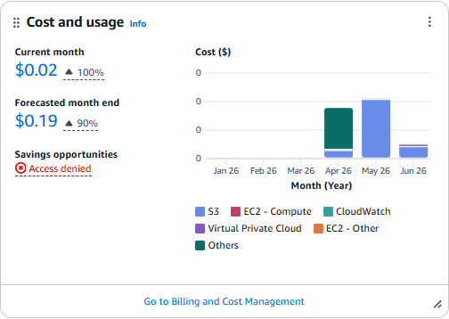

### 7.2 為什麼幾乎不花錢——這是工程選擇的成本實證

成本趨近於零**不是因為沒在用 AWS、而是因為選對了服務形態**（呼應 §3.5 Lambda > Glue）：

| 設計選擇 | 對成本的影響 |
|---|---|
| **純 Lambda**（按呼叫計費、無常駐叢集） | vs Glue Spark / EMR / Redshift 的常駐叢集**省去整筆固定費**——清洗一個月只跑一次 ~14 分鐘、用多少算多少 |
| **Athena 10 MB scan cap** | Athena 按掃描量計費（$5/TB），單次查詢掃 < 30 KB → 幾乎不計 |
| **S3 標準儲存量小** | 單月 cleaned.parquet 僅 ~75 KB（型別修正 INT32 後）；raw 雖 22 GiB 但 demo 期短暫 |
| **SQS / Glue Data Catalog** | 用量在 AWS 免費額度內 |
| **無 EC2 / RDS / Redshift 常駐資源** | 零「開著就計費」的服務 |

### 7.3 節省策略

全棧採「**按用量計費 + 無常駐**」服務組合：Lambda（按呼叫）+ Athena（按掃描、加 scan cap 護網）+ S3（按儲存）+ SQS/Glue（免費額度）。要再省，只需 demo 後對 raw/ 加 S3 lifecycle 自動清理。**「對的工具解對的問題」不只跑得動、還省得下——這是 §3.5 工程取捨在帳單上的證據。**

> 註：Cost Explorer 的「Savings opportunities」顯示 Access denied，是 Learner Lab 帳號政策限制（無 Cost Optimization Hub 權限）、非設定缺漏。

---

## §8 結語

### §8.1 學習心得（各組員）

> 依規則 R17：每位組員一段 80-100 字、結構含 **技能 + 可改進之處 + 團隊合作** 三要素。下列初稿由團隊技術主筆統整、各組員在繳交前依個人口吻調整。

**【謝晴如 — 114021168 / 文書製作 25%】**

技能：學會把工程團隊的散亂技術紀錄（git commit、AWS 截圖、實驗事件）整理成符合學術寫作規範的書面 + 簡報、並用 AI Studio HTML 動畫工具把單調的架構圖做成可互動展示。可改進處：報告排版字型與資料圖表配色第一版有對比度不足、後續再調；簡報動畫節奏一開始太快、demo 試講後才校到合適速度。團隊合作：與 3 位實作組員每日同步進度、把他們寫的技術術語翻成讓老師看得懂的中文敘述、學到「**翻譯就是價值**」這件事。

**【辛弈序 — 112021004 / 系統實作 25%】**

技能：第一次接觸 AWS 雲端服務、學會用 Terraform 把基礎設施寫成程式碼（infrastructure as code）、跑一次 `terraform apply` 就把 S3 + Lambda + Glue + Athena + SQS 全部建好。可改進處：對 SQS 與 Lambda event source mapping 的 visibility timeout 一開始設錯（< Lambda timeout 導致重複觸發）、debug 半天才發現；應該開工前先看 AWS 官方文件、不要直接抄範例。團隊合作：和組員把模組職責切清楚（infra / cli / lambda 分開）、降低 git 衝突；分工明確 = 並行開發效率高。

**【謝秉宏 — 112021024 / 系統實作 25%（系統架構 + AI 協作整合）】**

技能：學會用 TypeScript + ink 寫 TUI wizard、設計跨層 schema mapping（Pascal → snake_case）、debug 跨層型別不一致問題（JS Number → Parquet DOUBLE → Glue INT mismatch、§3.4 三連 evidence chain）；同時學會用 AI 模型作技術整合駕駛、把 1 個人的開發效率擴張成多個並行 worker 的吞吐。可改進處：§3.4 schema bug 如果提早寫 Lambda unit test 應該可早 1 天抓到；過度信任 polars 自動推斷型別、跨層處應一律顯式宣告。團隊合作：擔任技術整合 + 任務派工角色、把組員提的 idea 轉成可執行的工作項目、學到「**好的提示詞 = 好的產出**」。

**【陳睿綸 — 113021091 / 系統實作 25%】**

技能：學會 Node.js 非同步事件處理（API Gateway → SQS → Lambda dual dispatch）、理解為何雲端服務有「30 秒 timeout 硬上限」這種反直覺限制、用 producer-consumer pattern 解掉看似無解的時間鴻溝（30 秒 vs 14 分鐘、§3.2）。可改進處：第一版 wizard 的進度條卡住時沒做 timeout reset、user 體驗不好；應該對所有等待操作都加超時保護。團隊合作：負責整合 CLI 跟 Lambda 後端、與謝秉宏對 schema 規格做了多次 sync、學到「**接口先定義、實作再來**」可以省很多重工。

---

### §8.2 工程方法論收穫

1. **抓 bug 看完整 stack**（§3.4 教訓：CAST 救不了是因為錯不在 SQL）
2. **明示優於推斷**（§3.4 schema 修法：跨層邊界顯式宣告 type）
3. **對的工具解對的問題**（§3.5 Lambda > Glue ETL）
4. **時間壓力下縮 scope、不降品質**（§3.8 §0.3 4 步妥協機制）
5. **工程價值是可重現 + 可審計 + 可傳承**（§5 對比）

---

## §9 小組會議紀錄

> 依規則 R16：含討論內容與照片。本專題以 LINE 視訊群通為主要例行同步管道、配合 Discord 文字頻道做非同步技術討論、git commit message 留長期紀錄。下表列實體 / 線上會議重點。

### 9.1 視訊對齊會議 — 2026/06/05 深夜

| 項目 | 內容 |
|---|---|
| 時間 | 2026/06/05（週四）01:19 起、約 60 分鐘 |
| 形式 | LINE 視訊群通（4 人皆出席：謝秉宏 / 陳睿綸 / 辛弈序 / 謝晴如）|
| 主持 | 謝秉宏（系統實作主筆、PR 整合者）|

**議題與討論**：

1. **對齊 v2 系統架構現況**
   - 確認 §2 五件套（CLI + Lambda + S3 + Glue + Athena）皆已部署且 Athena 可查
   - 同步 §3.4 schema 型別漂移 bug 的修補進度（commit a381a2d）與重新部署狀態
   - 確認 §4.1 端到端跑通數據：3 月份 14,116 行、總 12.0 GB raw 三月份均落地

2. **書面報告最終結構拍板**
   - 採「系統 narrative 前置 + 視覺化分析後段」雙重結構，避免讓資料分析喧賓奪主
   - 確認 §3 八大概念設計重點不刪減（與 PPT、影片三件套同源 narrative）
   - §4.3 視覺化以仿期中 `step2_visualization` 風格為主、不使用 AI / Gemini API、純手動分析

3. **PPT 製作分工**
   - 由謝晴如主導文書產出（AI Studio HTML 動畫簡報、§5 對比表轉視覺）
   - 三位實作組員提供素材與技術勘誤、PPT 視覺風格 / 動畫節奏交由文書手裁決

4. **規則對齊**
   - 收 ai_workspace 線下 4 月 raw 至本帳號 bucket、Lambda 重清洗以達成 R11 8 週 Volume 標的
   - 補 R12 數據分析 §4.3 + R17 學習心得 §8.1 + 本節 R16 會議紀錄

**決議**：
- 報告以「同一套系統下、僅資料月份不同的多次跑通」展示通用性、不強調「我們做了多少新分析」
- 6/9 前完成 YouTube 影片錄製與上傳、URL 另於 Tronclass 提交
- 6/10 繳交當日中午前共同 review 一次 PDF 印製版

**會議紀錄照**：


> 註：本會議紀錄以團隊主要同步形式（LINE 視訊）的真實截圖為佐證；另有多次非同步討論散布於 git commit message（commit hash 可追溯所有設計決定）與專案內 `workflow/實驗紀錄10.md` 事件五段式紀錄、構成本專題的完整工程文檔軌跡。

